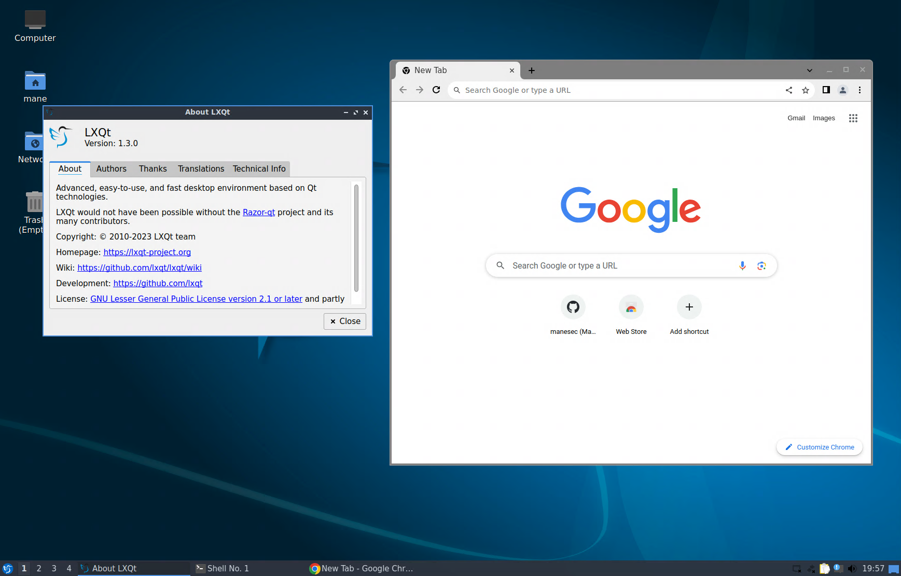

# Lubuntu-Docker-Desktop
Run Lubuntu Desktop in Docker container.  XRDP support only !!

[中文](README_ZH.md)




## Feature
+ Base on Ubuntu 23.10.
+ LXQt 1.3.0
+ Supports XRDP audio output (Patched with pulseaudio-module-xrdp).
+ Using `apt-fast` to speedup apt download.
+ LXQT Desktop Environment.
+ Easy to modify source code.
+ RDP Only.
+ Installed Firefox, Chrome, Vscode.

## Quick Run

**Note:** If running docker in PVE's LXC, additional settings are required, please see the FAQ below !!

``` bash
docker run -p 3389:3389 -it --cap-add=SYS_ADMIN --shm-size 1g --device /dev/fuse:/dev/fuse --rm manesec/lubuntu-desktop /bin/RunOnce.sh mane maneisagoodman
```

Once the boot is complete, you can use RDP to connect.

Note that: 
+ `--rm run once` 
+ `--cap-add=SYS_ADMIN` and `--shm-size 1g` : used for google-chrome and firefox.
+ `--device /dev/fuse:/dev/fuse` To fix appImage like app error.
+ `mane` is login username, you can feel free to change.
+ `maneisagoodman` is login password, you can feel free to change.

X64 working good, I have not test for arm and X86.

## How to Build ?

``` bash
git clone https://github.com/manesec/Lubuntu-Docker-Desktop.git Lubuntu-Docker-Desktop
cd Lubuntu-Docker-Desktop
docker build -t lubuntu-desktop .
docker run -p 3389:3389 -it --init --cap-add=SYS_ADMIN --shm-size 1g  --device /dev/fuse:/dev/fuse --rm lubuntu-desktop /bin/RunOnce.sh mane maneisagoodman
```


## Folder information

When you build a docker image, using `docker build -t lubuntu-desktop .`, it will install some software in `software` folder.

To disable it, just change name without `.sh`, For example:

+ I am not going to install google-chrome: Goto `software`, change `chrome.sh` to `chrome.disable`.


# FAQ

## FAQ: Run docker container over LXC container (Like PVE)


You should enable Fuse in LXC.

## FAQ: What is the root Password ?

The root password is random, you can check when you start the container.

```bash
root@manepc:/home/mane/Lubuntu-Docker-Desktop# docker run -p 3389:3389 -it --init --cap-add=SYS_ADMIN --device /dev/fuse:/dev/fuse --shm-size 1g --rm lubuntu-desktop /bin/RunOnce.sh mane maneisagoodman
...
[*] Random Password
Root Password: 8bfb45234ecf8d11b346
...
```

I am very recommend to use `sudo -s` to get root user.

## FAQ: No sound output?

You may need to run `pulseaudio -D` as root user.

# Have a question?

Feel free to submit a issue.

# License 
GNU General Public License v3.0
