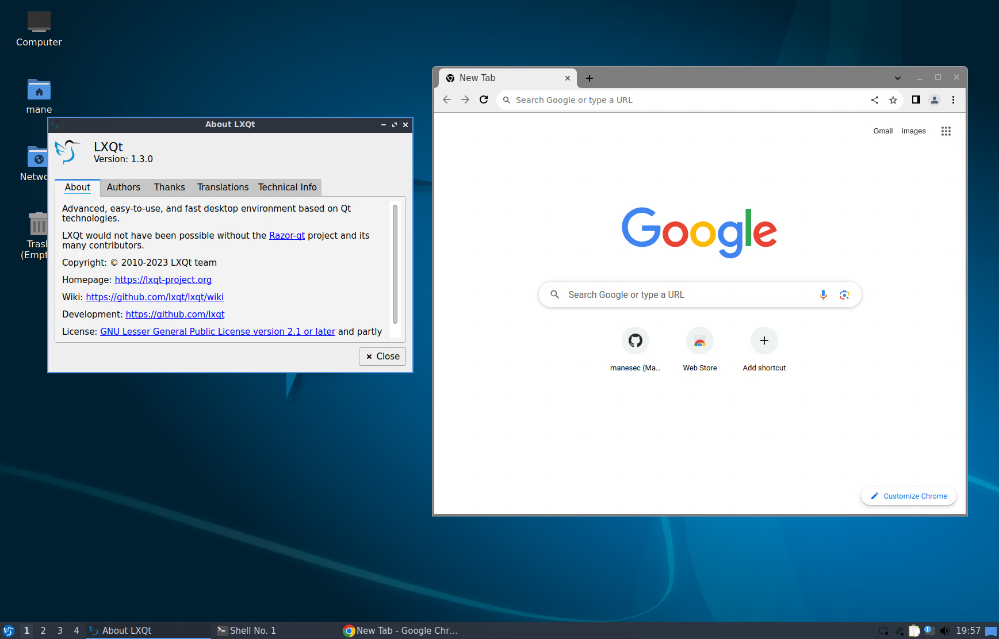
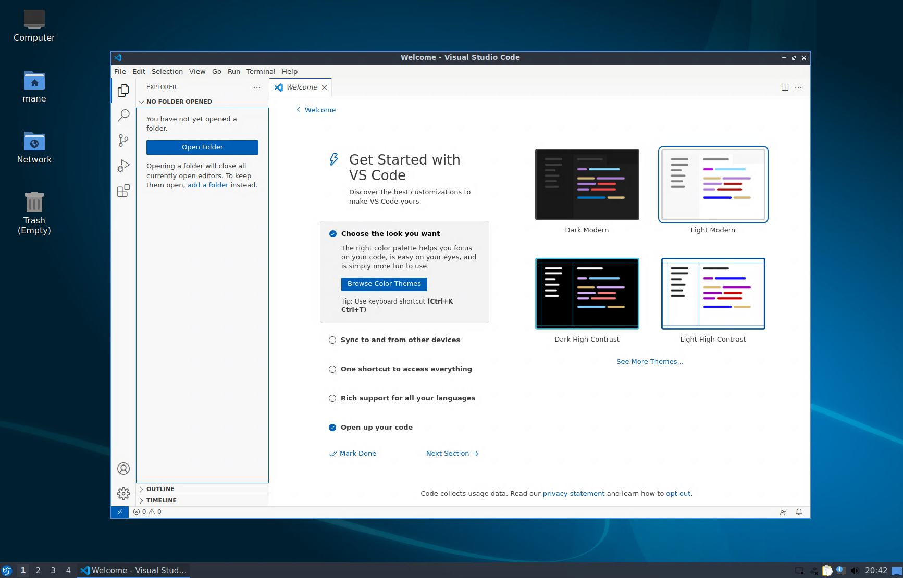
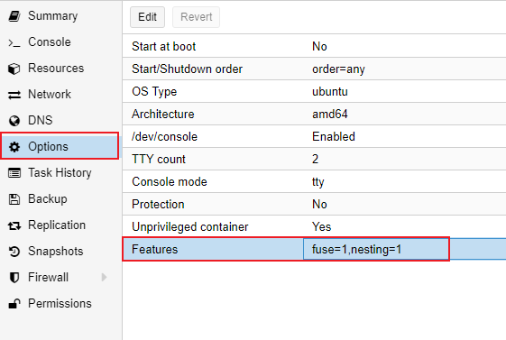

# Lubuntu-Docker-Desktop
在 Docker 容器内運行 Lubuntu Desktop，使用RDP协议链接。

注意: 僅支持 RDP 协议。






## 功能
+ 基於 Ubuntu 23.10
+ LXQt 1.3.0
+ 支持 XRDP 音頻輸出（使用 pulseaudio-module-xrdp 補丁）
+ 使用 `apt-fast` 來加速 apt 下載
+ LXQT 桌面環境，簡單輕量
+ 易於修改源代碼
+ 僅RDP協議
+ 内置 Firefox, Chrome, Vscode
+ RDP 的複製粘貼可以工作

## 快速运行

**注意：** 如果運行在PVE的LXC裡面的docker，需要額外設置，請看下面的常見問題！！

``` bash
docker run -p 3389:3389 -it --cap-add=SYS_ADMIN --shm-size 1g --device /dev/fuse:/dev/fuse --rm manesec/lubuntu-desktop /bin/RunOnce.sh mane maneisagoodman
```

一旦啓動完成，就可以使用RDP連接。

參數解释：
+ `--cap-add=SYS_ADMIN` 和 `--shm-size 1g` ：用於 google-chrome 和 firefox，不然会容易崩溃。
+ `--device /dev/fuse:/dev/fuse` 修復 AppImage 类型的APP错误。
+ `mane` 是登錄RDP的用戶名，隨意修改。
+ `maneisagoodman` 是登錄RDP的密碼，隨意修改。

X64運行良好，arm應該不工作（未測試），X86未測試。

## 如何编译？

``` bash
git clone https://github.com/manesec/Lubuntu-Docker-Desktop.git Lubuntu-Docker-Desktop
cd Lubuntu-Docker-Desktop
docker build -t lubuntu-desktop .
docker run -p 3389:3389 -it --cap-add=SYS_ADMIN --shm-size 1g --device /dev/fuse:/dev/fuse --rm lubuntu-desktop /bin/RunOnce.sh mane maneisagoodman
````

## `software` 文件夾

當您使用`docker build -t lubuntu-desktop .` 構建 docker 映像時，它將在 `software` 文件夾里執行所有.sh 文件。

要禁用它，只需更改不帶`.sh`的名稱，例如：

+ 我不打算安裝 google-chrome：把，將 `software` 文件夾里的 `chrome.sh` 更改為`chrome.disable` 就可以了。


# 常問問題

## FAQ: 我在 LXC 容器里面安装Docker，然后在Docker里面安装，需要做什么？ （类似PVE环境）



只需要启用 LXC 的 Fuse 功能即可。

## 常見問題：root 密碼是什麼？

root密碼是隨機的，啟動容器時可以查看。

````bash
root@manepc:/home/mane/Lubuntu-Docker-Desktop# docker run -p 3389:3389 -it --cap-add=SYS_ADMIN --device /dev/fuse:/dev/fuse --shm-size 1g --rm lubuntu-desktop /bin/RunOnce.sh mane maneisagoodman
...
[*] 隨機密碼
根密碼：8bfb45234ecf8d11b346
...
````

我強烈建議使用 `sudo -s` 來提升 root 用戶。

## 常見問題：沒有聲音輸出？

您可能需要以 root 用戶身份運行 `pulseaudio -D`。


# 有問題？

請隨意發起Github的issue。

# 許可證

GNU 通用公共許可證 v3.0

